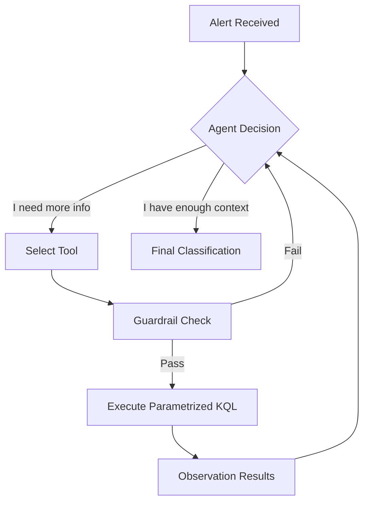

# Phase 2 Design: Agentic Investigation & Guardrails

This document outlines the architectural approach for upgrading the SOC AI Triage Agent to **Phase 2**, introducing autonomous investigative capabilities (Agentic Workflow).

## 1. Core Philosophy: "Safe Autonomy"

Many enterprise tools fail because they give LLMs direct access to write database queries (e.g., "Write KQL to find bad stuff"). This leads to hallucinations (invalid syntax) and resource exhaustion (massive queries that crash the cluster).

**Our Strategy:** **Parametrized Tool Use**.
The agent will **not** write KQL. It will select from a menu of pre-optimized, safe python functions that execute KQL on its behalf. This eliminates syntax errors and protects the database.

## 2. Architecture: The Analyst Loop

We will transition from a linear pipeline to a **ReAct (Reason + Act)** loop.

## 3. The Guardrails System (Protection Layer)

To protect costs (compute/time) and prevent hallucinations, we implement strict boundaries **before** and **after** tool execution.

### A. Hallucination Guardrails (Input Side)
*   **No Raw KQL Generation:** The LLM never sees KQL syntax. It only sees function definitions like:
    *   `search_ip_activity(ip_address: str, lookback_hours: int)`
    *   `get_process_tree(pid: int)`
*   **Strict Parameter Validation:** If the LLM tries to search for an IP "1.2.3.256" (invalid), the Python layer blocks it before touching Elastic.

### B. Cost & Resource Guardrails (Execution Side)
*   **The "3-Hop" Limit:** The loop is hard-coded to exit after a maximum of 3 investigation steps. This prevents infinite loops or analyzing a rabbit hole forever.
*   **Scope Enforcment:** Queries are programmatically forcibly limited to the alert's timeframe (+/- 24 hours). The LLM cannot accidentally query the "last 5 years" of data.

## 4. Implementation Plan

### Step 1: Tool Definitions (`elastic/tools.py`)
Create a new file for the specific investigative actions.
*   **Tool 1: `find_related_events`**: Searches for other events involving the same Subject (User) or Object (IP/File) within the timeframe.
*   **Tool 2: `check_threat_intel`**: (Preparation for Phase 3) Checks internal blacklists.

### Step 2: The Agent Loop (`triage/agent.py`)
Create a new class `InvestigationAgent` that replaces the simple `AlertClassifier`.
*   It maintains a `history` (list of messages).
*   It appends the "Observation" (query result) back to the prompt history.

### Step 3: Unified Prompting
Update `llm/prompts.py` to support tool selection.
*   *System Prompt Update:* "You are an investigator. You have access to these tools. Use them to gather evidence before making a verdict."

## Example Workflow
1.  **Alert:** "Suspicious PowerShell from User 'Bob'"
2.  **Agent Thought:** "I see Bob ran PowerShell. I need to know if Bob usually runs PowerShell or if this is new."
3.  **Agent Action:** Call `search_user_activity(user="Bob", action="process_start", days=30)`
4.  **Observation:** "Bob has run PowerShell 0 times in the last 30 days."
5.  **Agent Verdict:** "Malicious. Reasoning: Rare anomaly confirmed by unique history check."
