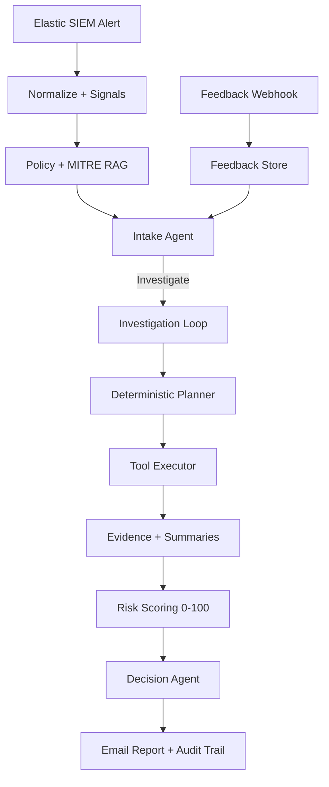
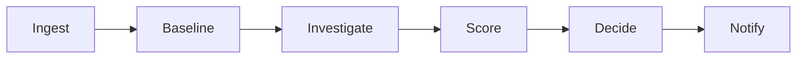

# Enterprise Agentic SOC: AI-Powered Security Alert Triage

An autonomous, multi-agent SOC triage platform that combines deterministic security logic with adaptive LLM reasoning to triage alerts at scale. Built for repeatable decisions, transparent audit trails, and rapid analyst feedback loops.

- Python 3.10+
- Elastic SIEM ingest
- Local or external LLMs
- Deterministic risk scoring (0-100)
- Feedback ingestion endpoint (Jira webhook)

## Quick Start

1) Install dependencies
```
python -m pip install -r requirements.txt
```

2) Configure environment
```
copy .env.example .env
```

3) Run
```
python main.py
```

## Architecture (Condensed)



## Simple Flow



## What Runs First

- Recent host alerts (last 24h)
- Baseline host logs (+/- 3 minutes)
- Then evidence-driven investigations with narrow, quoted SIEM filters

## Core Capabilities

- Deterministic signal extraction (behavioral + context)
- Evidence-anchored SIEM queries (tight windows, no duplicates)
- Risk scoring matrix with clear thresholds
- Structured decision output + audit trail
- Feedback webhook for analyst labels

## Feedback Webhook (Jira)

FastAPI listener that prints raw Jira payloads (first pass) and returns 200.

- POST `https://api.gabessoc.com/webhook/jira`
- Header: `X-API-Key: <FEEDBACK_API_KEY>`

Run locally:
```
python -m uvicorn feedback_api.app:app --host 0.0.0.0 --port 8001
```

## Configuration

See `.env.example` for required variables:
- Elastic SIEM settings
- LLM settings
- Resend email settings
- Feedback API key

## Project Structure

```
soc-ai-TriageAgent/
|-- agents/
|-- control/
|-- intake/
|-- llm/
|-- mcp_server/
|-- rag/
|-- schemas/
|-- tools/
|-- utils/
|-- main.py
```

## Detailed Documentation

Deep technical details have moved to the repo wiki:
- Scoring matrix and thresholds
- SIEM query library and field mapping
- RAG indexing and retrieval strategy
- Feedback loop design
