# Enterprise Agentic SOC: AI-Powered Security Alert Triage

> **An autonomous, multi-agent security operations platform** that combines deterministic cybersecurity logic with adaptive LLM reasoning to intelligently triage security alerts at scale.

[](https://www.python.org/downloads/)
[](https://opensource.org/licenses/MIT)
[](https://ollama.ai/)
[](https://openai.com/)
[](https://resend.com/)
[](https://www.elastic.co/)

---

## Table of Contents
- [Overview](#overview)
- [Key Features](#key-features)
- [System Architecture](#system-architecture)
- [Workflow Pipeline](#workflow-pipeline)
- [Module Documentation](#module-documentation)
- [Installation](#installation)
- [Configuration](#configuration)
- [Usage](#usage)
- [Project Structure](#project-structure)
- [Feedback Loop](#feedback-loop)
- [Detailed Documentation](#detailed-documentation)

---

## Overview

The **Enterprise Agentic SOC** is a state-of-the-art autonomous security operations platform designed to handle the overwhelming volume of security alerts in modern SOCs. By combining **deterministic pattern matching** (Signal Engine) with **adaptive LLM reasoning** (Multi-Agent System), it achieves:

- **Zero hallucinations** on foundational security facts
- **Transparent decision-making** with complete audit trails
- **Scalable 24/7 triage** without human fatigue
- **Dual LLM Support**: Choose between privacy-first local models (Ollama) or high-performance external APIs (OpenAI-compatible)

### The Problem It Solves
Modern SOCs face:
- **Alert fatigue**: 1000+ alerts per day, 95% false positives
- **Inconsistent triage**: Human analysts vary in experience and approach
- **Slow response times**: Manual investigation takes 15-30 minutes per alert
- **Lack of transparency**: "Black box" AI decisions without audit trails

### The Solution
A **hybrid intelligence platform** that:
1. Uses **deterministic logic** to extract 50+ behavioral signals (AMSI bypasses, LOTL binaries, encoded commands)
2. Employs **multi-agent AI** to reason about complex attack patterns
3. Enforces **policy guardrails** at every decision point
4. Maintains **100% audit compliance** with complete investigation records
5. Delivers **structured triage reports** directly to Jira via email (Resend SDK)

---

## Key Features

### Hybrid Intelligence & Dual LLM Support
- **Signal Engine**: Deterministic regex/heuristic-based detection of 50+ attack patterns
- **Multi-Agent System**: Specialized AI agents for intake, investigation, reasoning, and decision-making
- **Flexible LLM Backend**: Interactive selection between Local Ollama and External APIs
- **RAG-Enhanced**: MITRE ATT&CK knowledge base integration via vector search

### Enterprise-Grade Governance & Notifications
- **Policy Engine**: Runtime enforcement of tool permissions, depth limits, and forbidden actions
- **Internal Triage Notifications**: Automated reports sent via **Resend SDK** for Jira integration
- **Dual Confidence Gates**: Operational (fact-based) and Analytical (reasoning quality) checks
- **Token Guard**: Prevents infinite loops with configurable iteration limits

### Active Investigation Capabilities
- **MCP Tool Integration**: SIEM queries, VirusTotal lookups, CloudTrail audits (Entra disabled unless configured)
- **Evidence-Anchored Queries**: Tight time windows and quoted filters to reduce noise
- **Iterative Evidence Gathering**: Up to 10 investigation loops with intelligent stopping criteria

---

## System Architecture

### High-Level Component View

```mermaid
graph TB
    %% Styling
    classDef ingestion fill:#1a237e,stroke:#0d47a1,stroke-width:3px,color:#fff
    classDef normalization fill:#283593,stroke:#1976d2,stroke-width:3px,color:#fff
    classDef intel fill:#512da8,stroke:#7b1fa2,stroke-width:3px,color:#fff
    classDef governance fill:#c62828,stroke:#d32f2f,stroke-width:3px,color:#fff
    classDef agents fill:#00695c,stroke:#00897b,stroke-width:3px,color:#fff
    classDef tools fill:#e65100,stroke:#f57c00,stroke-width:3px,color:#fff
    classDef decision fill:#2e7d32,stroke:#43a047,stroke-width:3px,color:#fff
    classDef audit fill:#37474f,stroke:#546e7a,stroke-width:3px,color:#fff
    classDef feedback fill:#455a64,stroke:#607d8b,stroke-width:3px,color:#fff

    Start([Raw Security Alert<br/>Elastic/Splunk]) --> Ingest

    subgraph "Layer 1: Ingestion & Normalization"
        Ingest[Alert Ingestor<br/>intake/ingest.py]:::ingestion
        Ingest --> PreClass{Pre-Classifier<br/>intake/pre_classifier.py}:::ingestion
        PreClass -->|Empty Alert| Exit1[Skip Processing]
        PreClass -->|Valid Alert| SignalEng[Signal Engine<br/>intake/logic.py]:::normalization
        
        SignalEng --> Signals[50+ Behavioral Signals<br/>- AMSI Bypass<br/>- LOTL Binaries<br/>- Encoded Commands<br/>- External Comms]:::normalization
        Signals --> Schema[Normalized Schema<br/>schemas/alert.py<br/>NormalizedSecurityAlert]:::normalization
    end

    Schema --> Policy

    subgraph "Layer 2: Governance & Intelligence"
        Policy[Policy Engine<br/>control/policy_engine.py]:::governance
        Policy --> PolicyCheck{Policy Decision<br/>- Tool Permissions<br/>- Max Depth<br/>- Forbidden Actions}:::governance
        
        PolicyCheck -->|Denied| Exit2[Policy Violation]
        PolicyCheck -->|Approved| MITRE
        
        MITRE[MITRE RAG<br/>context/rag.py<br/>rag/vectordb.py]:::intel
        MITRE --> VectorDB[(Chroma Vector DB<br/>ATT&CK Techniques<br/>D3FEND Controls)]:::intel
        VectorDB --> TechMap[Technique Mapping<br/>context/mitre_map.py]:::intel
    end

    TechMap --> LLMChoice

    subgraph "Layer 3: Multi-Agent Orchestration"
        LLMChoice{LLM Selection<br/>Local vs External}:::agents
        LLMChoice --> IntakeAgent[Intake Agent<br/>agents/intake_agent.py<br/>Role: Gatekeeper]:::agents
        
        IntakeAgent --> IntakeDecision{Decision Logic<br/>Confidence >95%?}:::agents
        IntakeDecision -->|Benign| Close[Auto-Close<br/>No Investigation]
        IntakeDecision -->|Suspicious| InvLoop[Investigation Loop]:::agents
        
        InvLoop --> ConfGate1{Confidence Gate 1<br/>core/confidence.py<br/>Operational Check}:::governance
        ConfGate1 -->|Low Confidence| InvAgent
        ConfGate1 -->|High Confidence| ReasonAgent
        
        InvAgent[Investigation Agent<br/>agents/investigation_agent.py<br/>Role: Tier-1 Investigator]:::agents
        InvAgent --> Intent[Intent Generation<br/>LLM-Driven]:::agents
        
        Intent --> Planner[Deterministic Planner<br/>control/planner.py]:::governance
        Planner --> PlanLogic{Planning Strategy<br/>1. MITRE-Based<br/>2. Intent-Based<br/>3. Signal-Based}:::governance
        
        PlanLogic --> ToolPlan[Tool Execution Plan<br/>List of Tool Calls]:::tools
        ToolPlan --> ToolCheck{Policy Check<br/>Duplicate Detection<br/>Permission Validation}:::governance
        
        ToolCheck -->|Denied| Skip[Skip Tool]
        ToolCheck -->|Approved| Executor
        
        Executor[Tool Executor<br/>tools/executor.py]:::tools
        Executor --> MCP[MCP Tools<br/>mcp_server/tools/]:::tools
        
        MCP --> SIEM[SIEM Query<br/>siem.py]:::tools
        MCP --> VT[VirusTotal<br/>virustotal.py]:::tools
        MCP --> Cloud[CloudTrail<br/>cloudtrail.py]:::tools
        
        SIEM & VT & Cloud --> Formatter[Output Formatter<br/>mcp_server/formatter.py]:::tools
        Formatter --> Summarizer[Result Summarizer<br/>tools/summarizer.py<br/>Smart Context Pruning]:::tools
        
        Summarizer --> Evidence[Evidence Store<br/>schemas/state.py<br/>InvestigationState]:::audit
        Evidence --> LoopAudit[Loop Audit Record<br/>Intent + Tools + Results]:::audit
        
        LoopAudit --> TokenGuard{Token Guard<br/>control/token_guard.py<br/>Iteration Limit Check}:::governance
        TokenGuard -->|Max Iterations| ForceExit[Force Exit to Decision]
        TokenGuard -->|Continue| InvLoop
        
        ReasonAgent[Reasoning Agent<br/>agents/reasoning_agent.py<br/>Role: Tier-2 Analyst]:::agents
        ReasonAgent --> Analysis[Deep Analysis<br/>Connect the Dots<br/>Build Narrative]:::agents
        
        Analysis --> ConfGate2{Confidence Gate 2<br/>Analytical Check}:::governance
        ConfGate2 -->|Uncertain| InvLoop
        ConfGate2 -->|Confident| DecAgent
    end

    ForceExit --> DecAgent
    
    subgraph "Layer 4: Final Authority & Output"
        DecAgent[Decision Agent<br/>agents/decision_agent.py<br/>Role: SOC Manager]:::decision
        DecAgent --> FinalDecision{Final Classification<br/>- Benign<br/>- Suspicious<br/>- Malicious}:::decision
        
        FinalDecision --> JSONOut[Structured Output<br/>Summary + Evidence Table<br/>Score + Action]:::decision
        
        JSONOut --> EmailNotify[Email Notification<br/>Resend SDK Integration<br/>Triage Report]:::decision
        EmailNotify --> AuditExport[Audit Trail Export<br/>Complete Investigation Record]:::audit
    end
    
    AuditExport --> End([Case Resolution])

    subgraph "Feedback Loop"
        FeedbackIn[Jira Webhook<br/>feedback_api/app.py]:::feedback
        FeedbackIn --> FeedbackStore[(Feedback DB)]:::feedback
        FeedbackStore --> FeedbackRAG[Feedback Retrieval<br/>context/feedback_rag.py]:::feedback
        FeedbackRAG --> IntakeAgent
    end
```



### Color Legend
- **Dark Blue** (Ingestion): Raw data intake and normalization
- **Purple** (Intel): Knowledge base and semantic enrichment
- **Red** (Governance): Policy enforcement and safety controls
- **Teal** (Agents): AI-driven decision making and reasoning
- **Orange** (Tools): External data sources and APIs
- **Green** (Decision): Final authority and classification
- **Gray** (Audit): Compliance and transparency mechanisms
- **Slate** (Feedback): Analyst feedback loop

---

## Workflow Pipeline

### Phase 1: Ingestion & Normalization

**1. Alert Ingestor** (`intake/ingest.py`)
- Fetches raw alerts from Elastic using `.alerts-security.alerts-*`
- Maps ECS fields to `NormalizedSecurityAlert`

**2. Pre-Classifier** (`intake/pre_classifier.py`)
- Validates alert health and rejects empty/malformed alerts

**3. Signal Engine** (`intake/logic.py`)
- Deterministic logic: 50+ behavioral signals (AMSI bypass, LOTL, etc.)

### Phase 2: Governance & Intelligence

**4. Policy Engine** (`control/policy_engine.py`)
- Enforces tool permissions, depth limits, forbidden actions

**5. MITRE RAG** (`context/rag.py`, `rag/vectordb.py`)
- Semantic search over ATT&CK via ChromaDB

### Phase 3: Multi-Agent Orchestration

**6. LLM Support Selection**
- Interactive selection between Local (Ollama) or External (OpenAI-compatible)

**7. Intake Agent** (`agents/intake_agent.py`)
- Gatekeeper: filters false positives with >95% confidence threshold

**8. Investigation Agent** (`agents/investigation_agent.py`)
- Tier-1 investigator: generates technical tool intents

**9. Reasoning Agent** (`agents/reasoning_agent.py`)
- Tier-2 analyst: synthesizes evidence into narratives

### Phase 4: Final Authority & Output

**10. Decision Agent** (`agents/decision_agent.py`)
- SOC manager: final verdict
- Output includes summary, evidence table, final score, recommended action

**11. Email Notification** (`utils/email_notifier.py`)
- Resend SDK integration for Jira/SOC routing

**12. Audit Trail Export**
- Writes `audit_trail_[alert_id].json` for full transparency

---

## Module Documentation

### Layer 1: Ingestion & Normalization
| Module | File | Purpose |
|--------|------|---------|
| Alert Ingestor | `intake/ingest.py` | Fetches raw alerts from Elastic, maps ECS fields |
| Signal Engine | `intake/logic.py` | Deterministic logic: 50+ behavioral signals |

### Layer 2: Governance & Intelligence
| Module | File | Purpose |
|--------|------|---------|
| Policy Engine | `control/policy_engine.py` | Enforces tool permissions and depth limits |
| MITRE RAG | `context/rag.py` | Vector search over ATT&CK techniques |

### Layer 3: Multi-Agent Orchestration
| Module | File | Purpose |
|--------|------|---------|
| LLM Client | `llm/client.py` | Unified client supporting Local and External |
| Intake Agent | `agents/intake_agent.py` | High-confidence gatekeeper |
| Investigation Agent | `agents/investigation_agent.py` | Hypothesis-driven evidence gathering |
| Decision Agent | `agents/decision_agent.py` | Final authority with structured output |

### Layer 4: Notifications & Reporting
| Module | File | Purpose |
|--------|------|---------|
| Email Notifier | `utils/email_notifier.py` | Resend SDK integration |
| Result Summarizer | `tools/summarizer.py` | Context pruning and evidence shaping |

---

## Installation

### Prerequisites
- **Python 3.10+**
- **Elasticsearch** (accessible via API)
- **Ollama** (for local models)
- **Resend API Key** (for notifications)

### Setup
1. Clone the repo
2. `pip install -r requirements.txt`
3. Install Ollama and pull your preferred model (e.g., `ollama pull llama3.1:8b`)
4. Initialize the vector DB: `python rag/ingestion.py`

---

## Configuration

Create a `.env` file from `.env.example`:

```env
# Elastic SIEM
ELASTIC_BASE_URL=https://172.20.10.9:9200
ELASTIC_API_KEY=your-key

# LLM Configuration
LLM_MODEL="llama3.1:8b" # Local
EXTERNAL_LLM_API_KEY="sk-..."
EXTERNAL_LLM_URL="https://api.openai.com/v1/chat/completions"
EXTERNAL_LLM_MODEL="gpt-5.2"

# Notifications (Resend API)
RE_SEND_KEY="re_..."
NOTIFY_EMAIL="jira@yourdomain.atlassian.net"
FROM_EMAIL="soc-ai@yourdomain.com"

# Feedback Loop
FEEDBACK_API_KEY="your-key"
FEEDBACK_DB_PATH=feedback_api/feedback.db
```

---

## Usage

Run the orchestrator:
```bash
python main.py
```

1. The system fetches alerts from Elastic
2. You select Local or External LLM
3. The multi-agent pipeline executes investigation loops
4. Final triage reports are logged and emailed to the configured recipient

---

## Project Structure

```
soc-ai-TriageAgent/
├── agents/             # Multi-agent roles (Intake, Investigation, Reasoning, Decision)
├── control/            # Governance layer (Policy, Planner, Token Guard)
├── intake/             # Ingestion & Signal Engine
├── utils/              # Resend Email Notifier, Pipeline Logging
├── llm/                # Unified Client (Local/External)
├── rag/                # Vector DB and MITRE data ingestion
├── schemas/            # Pydantic state and alert models
├── tools/              # MCP Tool orchestration and summarization
├── feedback_api/       # Feedback webhook + storage
└── main.py             # Entry point
```

---

## Feedback Loop

FastAPI listener that receives Jira webhooks, normalizes payloads, and stores feedback for retrieval in new investigations.

- POST `https://api.gabessoc.com/webhook/jira`
- Header: `X-API-Key: <FEEDBACK_API_KEY>`

Run locally:
```bash
python -m uvicorn feedback_api.app:app --host 0.0.0.0 --port 8001
```

---

## Detailed Documentation

Deep technical details live in the repo wiki:
- Scoring matrix and thresholds
- SIEM query library and field mapping
- RAG indexing and retrieval strategy
- Feedback loop design
- Full pipeline breakdown: `docs/wiki/PIPELINE.md`

---

**Built with love for the SOC community**
