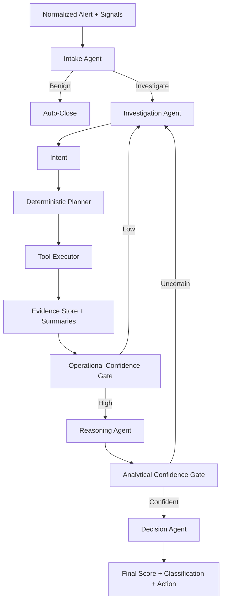

# Multi-Agent Handoff Flow

This diagram focuses on agent boundaries, inputs/outputs, and handoffs. It shows the multi-agent loop without the full system plumbing.

## Agent Handoff Notes

1) Intake Agent
- Input: normalized alert, signals, feedback lessons.
- Output: `close_benign` or `investigate`.

2) Investigation Agent
- Input: alert + evidence summaries + lessons learned.
- Output: natural-language intent describing next evidence to gather.

3) Deterministic Planner
- Input: intent + alert context.
- Output: tool call plan with strict filters and time windows.

4) Tool Executor
- Input: plan.
- Output: normalized tool results and summaries.

5) Reasoning Agent
- Input: full evidence store + signals.
- Output: narrative reasoning for decision stage.

6) Decision Agent
- Input: reasoning + evidence table + risk score.
- Output: final classification, score, and recommended action.
