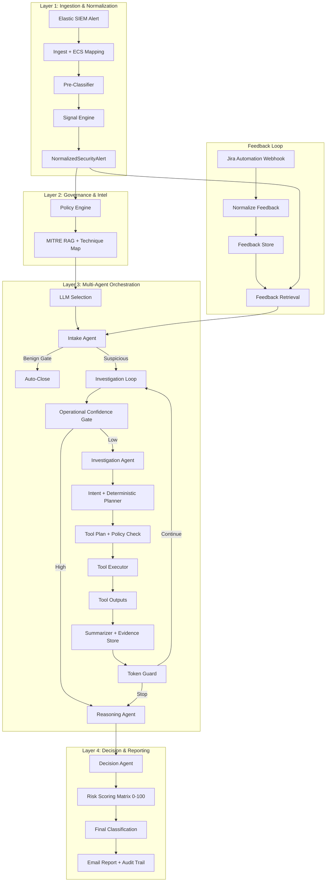

# Pipeline Deep Dive

This document describes the end-to-end pipeline in operational detail: inputs, normalization, query planning, evidence extraction, scoring, decisioning, notification, and analyst feedback retrieval.

## End-to-End Flow (Detailed)

## Data Contracts

### Normalized Alert (`schemas/alert.py`)
Core fields used by agents and planners:
- `alert`: ID, name, severity, timestamp, category, description.
- `detection`: rule ID/type, query logic, MITRE techniques, references.
- `execution`: process, PowerShell context.
- `entity`: host and user context.
- `analysis_signals`: deterministic signals (process, network, identity, defense evasion).
- `raw_context`: selected ECS fields (message, event_code, winlog channel, host OS, process args).

### Investigation State (`schemas/state.py`)
Key fields used during orchestration:
- `evidence`: structured evidence items.
- `ioc_store`: normalized IOCs (hash, domain, IP).
- `lessons_learned`: feedback retrieval results.
- `risk_score`: numeric 0-100.
- `evidence_table`: risk scoring table entries.

## Deterministic Planning & Querying

### Evidence-Anchored Queries
Queries are built from observed evidence in the alert context:
- Process candidates use `process_args_contains` with quoted values.
- Event IDs use `event_code` instead of free-text fields.
- Message filtering uses `message_contains` with quoted values.

### Query Laddering
Each loop selects the next most specific query:
1. IOC-first (if known IP/domain/hash exists).
2. Host + narrow time window (baseline).
3. Process/command evidence.
4. Message evidence.
5. Broader host window (last resort).

### Time Windows
Queries avoid point-in-time timestamps:
- Default time window is `alert_timestamp +/- 3 minutes`.
- Planner can expand windows stepwise, but avoids high-volume ranges.

### Duplicate Avoidance
The system tracks prior tool arguments per loop and suppresses identical queries.

## Scoring & Classification

### Risk Scoring Matrix (`core/scoring.py`)
Evidence items map to weights and confidence values:
- `score = sum(weight * confidence)`
- normalized to 0–100
- thresholds:
  - 0–20 Benign
  - 21–60 Suspicious
  - 61–100 Malicious

### Deterministic Output
Decision agent produces:
- Summary (4–6 sentences)
- Evidence table
- Final score and classification
- Recommended action

## Feedback Loop

### Jira Webhook Ingestion
`feedback_api/app.py` accepts Jira payloads and normalizes:
- issue key/summary/status
- close note
- detection classification
- triage verdict

### Storage (SQLite/Postgres)
`feedback_api/db.py` supports:
- SQLite default (`feedback_api/feedback.db`)
- Postgres via `FEEDBACK_DB_URL`

### Retrieval
`context/feedback_rag.py` uses structured search:
- matches on `issue_summary`, `description`, `close_note`
- optional host/user keywords
- returns most recent N items
- injected into `lessons_learned` for LLM grounding

## Operational Notes

- Token pruning is disabled when using external LLMs.
- Entra query tool is disabled if not configured.
- Baseline queries always run first:
  - last 24h host alerts
  - host logs +/- 3 minutes
