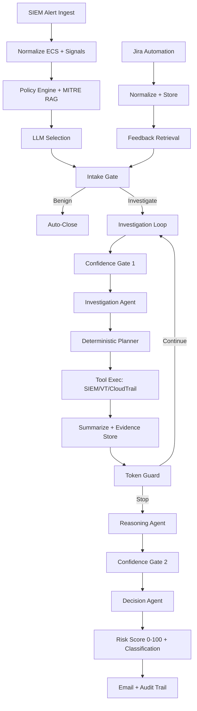

# Pipeline Summary Diagram

This diagram is a compact but technically faithful view of the pipeline, including governance, tool execution, scoring, and feedback.

```mermaid
flowchart TB
  A[SIEM Alert Ingest] --> B[Normalize ECS + Signals]
  B --> C[Policy Engine + MITRE RAG]
  C --> D[LLM Selection]
  D --> E[Intake Gate]
  E -->|Benign| F[Auto-Close]
  E -->|Investigate| G[Investigation Loop]
  G --> H[Confidence Gate 1]
  H --> I[Investigation Agent]
  I --> J[Deterministic Planner]
  J --> K[Tool Exec: SIEM/VT/CloudTrail]
  K --> L[Summarize + Evidence Store]
  L --> M[Token Guard]
  M -->|Continue| G
  M -->|Stop| N[Reasoning Agent]
  N --> O[Confidence Gate 2]
  O --> P[Decision Agent]
  P --> Q[Risk Score 0-100 + Classification]
  Q --> R[Email + Audit Trail]

  S[Jira Automation] --> T[Normalize + Store]
  T --> U[Feedback Retrieval]
  U --> E
```
