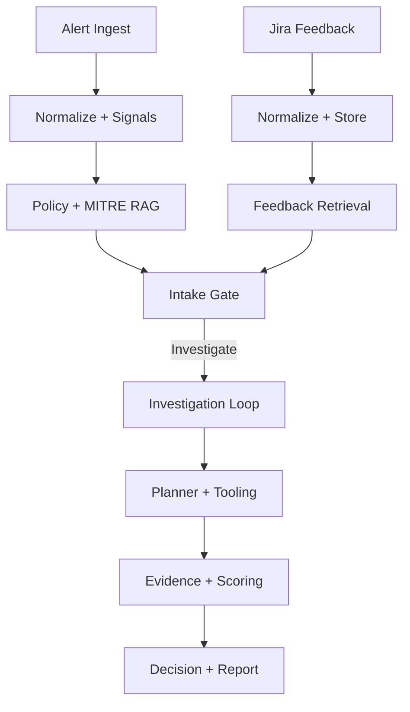

# Pipeline Summary Diagram

This summarized flow is designed for quick orientation without losing key detail.

```mermaid
flowchart TB
  A[Alert Ingest] --> B[Normalize + Signals]
  B --> C[Policy + MITRE RAG]
  C --> D[Intake Gate]
  D -->|Investigate| E[Investigation Loop]
  E --> F[Planner + Tooling]
  F --> G[Evidence + Scoring]
  G --> H[Decision + Report]
  I[Jira Feedback] --> J[Normalize + Store]
  J --> K[Feedback Retrieval]
  K --> D
```
